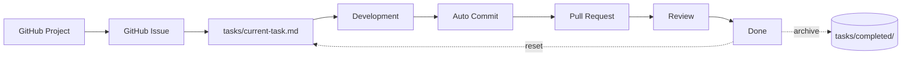

# Task management

This folder is the single source of truth for **what is being worked on and why**.
Work is driven one task at a time: the active task lives in `current-task.md`,
upcoming tasks are queued in `backlog/`, and finished tasks are archived in
`completed/`. Every task is shaped from `templates/task-template.md`.

## Folder layout

```
tasks/
├── current-task.md          # The one active task (source of truth for current scope)
├── backlog/                 # Queued tasks, one file per task (from the template)
├── completed/               # Finished tasks, archived with their Completion Summary
├── templates/
│   └── task-template.md     # Canonical task shape — copy this to start a task
└── README.md                # This file
```

## Workflow

```
GitHub Project → GitHub Issue → tasks/current-task.md → Development
      → Auto Commit → Pull Request → Review → Done
```



### 1. GitHub Project

Work is prioritised on the GitHub Project board. A card moves into the active
column when it is ready to be picked up.

### 2. GitHub Issue

Every task is anchored to a GitHub Issue (the canonical description, discussion
and acceptance criteria). The issue number is recorded in the task file under
**Related GitHub Issue**.

### 3. tasks/current-task.md

Create the active task by copying [`templates/task-template.md`](templates/task-template.md)
into `current-task.md` (or by promoting a file from [`backlog/`](backlog/)). Fill
in the title, issue link, requirements, acceptance criteria and the
**Files Expected To Change**. This file defines the **scope**: work stays inside it.

### 4. Development

Implement the task. Before touching an area, review the matching skill/agent (see
`CLAUDE.md` / `AGENTS.md`). Keep the **Progress Checklist** and **Status** current
as you go. Do not edit files outside **Files Expected To Change** without first
updating the task (or opening a new one).

### 5. Auto Commit

Commit through the autocommit workflow — `commands/autocommit.md` (run with
`/autocommit`; Claude uses `.claude/commands/`, Codex uses `.codex/commands/`).
That workflow already owns and enforces, per semantic group:

- the **pre-commit gate** — `npm run lint && npm test -- --run` (for `src/` changes);
- the **architecture audit gate** — must be `100/100` (Method A or the Method B fallback);
- the **i18n commit policy** — propagate `es.json` keys to `ca`/`en`, `npm run i18n:check`;
- the **documentation rule** — update `docs/documentacion.md` in the same commit when
  files/folders are added, removed, renamed or moved;
- **Conventional Commits**, one purpose per commit.

These rules are defined once in `autocommit.md` and the contracts — this folder does
not redefine them.

### 6. Pull Request

Open a PR for the task branch. Reference the issue (e.g. `Closes #123`). The PR
description summarises the outcome and links the commits.

### 7. Review

Code review, QA and (for UI) the Design & Responsive Validation. Address feedback
with new commits via the same autocommit workflow.

### 8. Done

When every **Acceptance Criteria** box is checked:

1. Write the **Completion Summary** in the task file.
2. Set **Status** to `Done`.
3. Move the file to [`completed/`](completed/) (e.g. `completed/<task-id>.md`).
4. Reset `current-task.md` from the template so the repo is ready for the next task.

## Task lifecycle & status

A task file moves `backlog/` → `current-task.md` → `completed/`. Its **Status**
field tracks execution:

| Status        | Meaning                                               |
| ------------- | ----------------------------------------------------- |
| `Backlog`     | Defined and queued, not started                       |
| `In Progress` | Actively being implemented                            |
| `In Review`   | PR open, awaiting review / QA                          |
| `Blocked`     | Cannot proceed — reason noted in **Notes**            |
| `Done`        | All acceptance criteria met; archived in `completed/` |
| `Example`     | Seed/sample content only — not an active task          |

## Conventions

- **One active task.** `current-task.md` holds exactly one task at a time.
- **One file per backlog task**, named by its Task ID (e.g. `20260610-minisearch-search.md`).
- **Task ID:** `YYYYMMDD-short-slug`.
- **Branch:** Conventional, scoped to the task (e.g. `feat/search-minisearch`).
- **English** for task files.

## Quick start

```bash
# Start a new task
cp tasks/templates/task-template.md tasks/current-task.md
# ...edit current-task.md (title, issue, scope), implement, then:
/autocommit
# When Status = Done, archive it:
mv tasks/current-task.md tasks/completed/<task-id>.md
cp tasks/templates/task-template.md tasks/current-task.md
```
